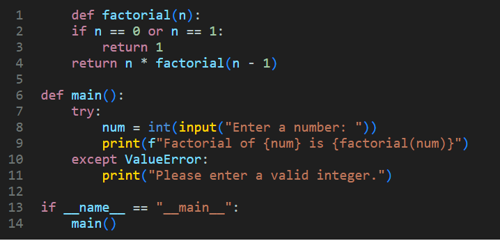

# CSH.js
CustomizableSyntaxHighlighter.js

# Usage:
- Donwload main.js and your preferred syntax highlighting color theme (incase you have to much overhead (weird, but ok), you also have .min versions).
- You also may define your own color scheme, by manually editing the `user.css` file.
- Link both files in the `<head>` tag:
  - `<link rel="stylesheet" href="./VSCode.css">`
  - `<script src="./main.js"></script>`
- Notice: to use the syntax highlighting, you have to define a `<pre>` block with your code, and add the `highlight_[language]` class to it, eg. if you have some python code, it should look something like this:
  - ```html
    <pre class="highlight_python">
    def factorial(n):
        if n == 0 or n == 1:
            return 1
        return n * factorial(n - 1)
    
    def main():
        try:
            num = int(input("Enter a number: "))
            print(f"Factorial of {num} is {factorial(num)}")
        except ValueError:
            print("Please enter a valid integer.")
    
    if __name__ == "__main__":
        main()
    </pre>
    ```
- Incase the language you specified isn't supported, you get a default black background & white-ish text color scheme.
- Now, you can use the library in 3 different ways:
  1. Calling `highlightCode()` anywhere in the program, will automatically select all `<pre>` tags in the document, search for the language in which the code is in, and apply the syntax highlighting for it + add line numbers.
  2. Calling `highlightCodes(node)` will automatically select all `<pre>` tags in the node you passed in as an argument, and do the same as the line above.
  3. With `node = highlightCodes(node)` you can apply the syntax highlighting before the node is added to the document (dynamic).
- After calling one of above ways, you get this result in your browser:



## Currently supports the following languages (evolving list):
- R
- Python
- SQL
- C#
